Projetos desenvolvidos nas aulas de Programação Orientada a Objetos II, no curso de formação em Java ADA B3+ Inclua.
# Biblioteca
O projeto simula um programa de gerenciamento de biblioteca que oferece serviços virtuais e no ambiente físico.

## Diagrama do projeto (Planejamento)

```mermaid
classDiagram

namespace service{
    class BibliotecaService
    class BibliotecaServiceImpl
    class BibliotecaServiceFisica
    class BibliotecaServiceVirtual
    class BibliotecaServiceFisicaImpl
    class BibliotecaServiceVirtualImpl
}

namespace persistence{
    class BibliotecaRepositorio
    class  BibliotecaRepositorioListImpl
}

namespace model{
    class ItemCatalogo
    class Livro
    class Revista
    class Manuscrito
    class Secao
    class Pessoa
    class Autor
    class Associado
}

namespace operacoes{
    class Operacoes
    class Reserva
    class Emprestimo
    class Multa
    class PagamentoMulta
    class Devolucao
}

<<Interface>>BibliotecaService
BibliotecaService: +setCatalogo(BibliotecaRepositorio catalogo)
BibliotecaService: + reservar(ItemCatalogo item)
BibliotecaService: + cancelarReserva(Reserva)
BibliotecaService: + consultar(ItemCatalogo item)
BibliotecaService: + consultar(String titulo)
BibliotecaService: + consultarAutor(String nomeAutor)
BibliotecaService: + consultarAutor(Autor autor)
BibliotecaService <|-- BibliotecaServiceFisica
BibliotecaService <|-- BibliotecaServiceVirtual

<<Interface>>BibliotecaServiceFisica
BibliotecaServiceFisica: + emprestar(ItemCatalogo item)
BibliotecaServiceFisica: + devolver(ItemCatalogo item)
BibliotecaServiceFisica: + cadastrar(ItemCatalogo)
BibliotecaServiceFisica: + pagarMulta(Multa)

BibliotecaServiceFisica ..|> BibliotecaServiceFisicaImpl
BibliotecaServiceFisicaImpl: + emprestar(ItemCatalogo item)
BibliotecaServiceFisicaImpl: + devolver(ItemCatalogo item)
BibliotecaServiceFisicaImpl: + cadastrar(ItemCatalogo)
BibliotecaServiceFisicaImpl: - BibliotecaRepositorio catalogo
BibliotecaServiceFisicaImpl: + pagarMulta(Multa)

<<Abstract>>BibliotecaServiceImpl
BibliotecaService ..|> BibliotecaServiceImpl
BibliotecaServiceImpl <|-- BibliotecaServiceFisicaImpl
BibliotecaServiceImpl <|-- BibliotecaServiceVirtualImpl
BibliotecaServiceImpl: # BibliotecaRepositorio catalogo
BibliotecaServiceImpl: +setCatalogo(BibliotecaRepositorio catalogo)
BibliotecaServiceImpl: + reservar(ItemCatalogo item)
BibliotecaServiceImpl: + cancelarReserva(Reserva)
BibliotecaServiceImpl: + consultar(ItemCatalogo item)
BibliotecaServiceImpl: + consultar(String titulo)
BibliotecaServiceImpl: + consultarAutor(String nomeAutor)
BibliotecaServiceImpl: + consultarAutor(Autor autor)

<<Interface>>BibliotecaServiceVirtual

BibliotecaServiceVirtual ..|> BibliotecaServiceVirtualImpl
BibliotecaServiceVirtualImpl: - BibliotecaRepositorio catalogo

<<Abstract>>ItemCatalogo
ItemCatalogo: - String titulo
ItemCatalogo: - Autor autor
ItemCatalogo: - Secao secao
ItemCatalogo: - Reserva reservaAtiva
ItemCatalogo: - Emprestimo emprestimo
ItemCatalogo: - List historico
ItemCatalogo: + getReserva() Reserva
ItemCatalogo: + setReservado(Reserva)
ItemCatalogo: + setEmprestado(Emprestimo)
ItemCatalogo: + getEmprestimo() Emprestimo
ItemCatalogo: +getTitulo() String titulo
ItemCatalogo: +getAutor() Autor autor
ItemCatalogo: + getSecao() Secao
ItemCatalogo: + setSecao(Secao)
ItemCatalogo: + equals(Object obj) boolean
ItemCatalogo <|-- Livro
ItemCatalogo <|-- Revista
ItemCatalogo <|-- Manuscrito

<<Interface>> BibliotecaRepositorio
BibliotecaRepositorio: + salvar(ItemCatalogo item)
BibliotecaRepositorio: + consultar(String titulo) boolean
BibliotecaRepositorio: + consultar(ItemCatalogo item) boolean
BibliotecaRepositorio: +getCatalogo() List<ItemCatalogo>

BibliotecaRepositorio ..|> BibliotecaRepositorioListImpl
BibliotecaRepositorioListImpl: - List<ItemCatalogo> catalogo
BibliotecaRepositorioListImpl: + salvar(ItemCatalogo)
BibliotecaRepositorioListImpl: + consultar(String titulo) boolean
BibliotecaRepositorioListImpl: + consultar(ItemCatalogo item) boolean
BibliotecaRepositorioListImpl: +getCatalogo() List<ItemCatalogo>

class Livro{
    -String isbn
    -String editora
    -String numeroPaginas
    + getIsbn() String isbn
    + getEditora() String editora
    + getPaginas() int numeroPaginas
}

class Revista{
    -int numeroEdicao
    -String mesPublicacao
    -String categoria
    + construtor com Secao.REVISTAS
    + getEdicao() int numeroEdicao
    + getMes() String mesPublicacao
    + getCategoria() String categoria
}

class Manuscrito{
    -String localOrigem
    -String estadoConservacao
    -boolean digitalizado
    + construtor com Secao.MANUSCRITOS
    + getLocal() String localOrigem
    + getConservacao() String estadoConservacao
    + getDigitalizado() boolean digitalizado
}

<<Enumerate>> Secao
class Secao{
    Artes e Cultura 
    Autoajuda e Desenvolvimento Pessoal 
    Biografias e Autobiografias 
    Ciências Naturais 
    Ciências Sociais 
    Esportes e Lazer 
    Ficção Científica e Fantasia 
    Gastronomia 
    História 
    Literatura Infantil 
    Literatura Juvenil
    Manuscritos 
    Poesia 
    Religião e Espiritualidade
    Revistas 
    Romance
    Tecnologia e Ciências Aplicadas
}

<<Abstract>> Pessoa
Pessoa: - String nome
Pessoa <|-- Autor
Pessoa <|-- Associado

class Autor{
    - String biografia
    - List<ItemCatalogo> obras
}

class Associado{
    - LocalDate dataDeCadastro
    - List historico
    - Emprestimo emprestimoAtivo
    - Reserva reservaAtiva
}

<<Abstract>> Operacoes
Operacoes <|-- Emprestimo
Operacoes <|-- Multa
Operacoes <|-- Reserva
Operacoes <|-- PagamentoMulta
Operacoes <|-- Devolucao

class Operacoes{
    - Associado associado
    - boolean virtual
    - ItemCatalogo item
    - LocalDate dataRealizada
    + setVirtual(boolean)
}

class Emprestimo{
    - setVirtual(boolean) @Override
    - LocalDate devolucao 
}

class Multa{
    - int valorInicial
    - int juros
    - int valorTotal
    - LocalDate hoje 
}

class PagamentoMulta {
    - setVirtual(boolean) @Override
}

class Devolucao{
    - setVirtual(boolean) @Override
}
```

## Processos - Swimlane

